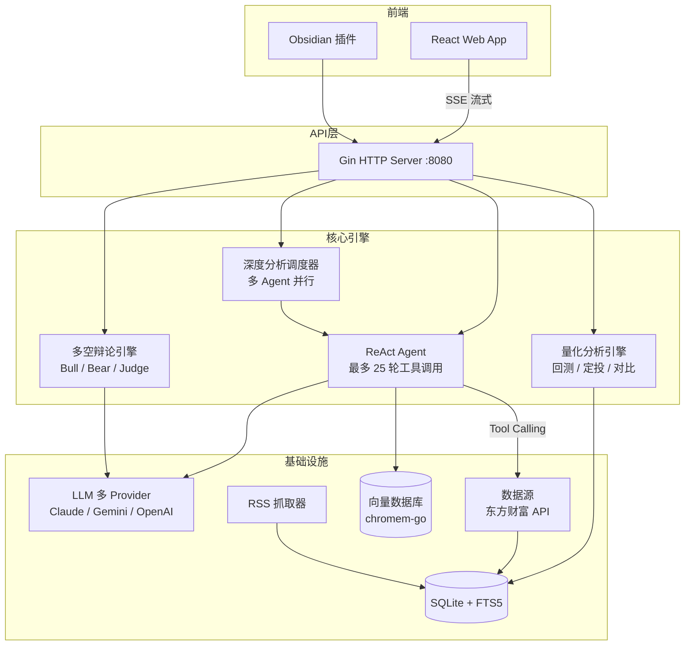

<div align="center">

# Quinfi

**面向个人投资者的 AI 基金投研助手**

用 AI Agent 对话式分析基金，多空辩论决策，量化回测验证

[](https://go.dev/)
[](https://react.dev/)
[](https://www.typescriptlang.org/)
[](LICENSE)

</div>

---

<!-- 截图区域 — 替换为实际截图路径 -->
<!-- <div align="center">
  
</div> -->

## 核心特性

**AI 对话分析** — 基于 ReAct 模式的智能 Agent，支持自然语言提问，自动调用工具链获取基金数据、持仓、净值并生成分析

**多空辩论引擎** — Bull/Bear/Judge 三角色 6 阶段辩论流程，多头空头并发攻防，独立置信度门控引擎自动触发复核

**量化分析工具箱** — 组合历史回测、定投模拟（固定/价值/智能三策略）、多基金对比与相关性矩阵分析

**智能持仓管理** — 支持截图识别自动导入持仓，动态计算盈亏，实时跟踪净值变动

**财经新闻聚合** — 多源 RSS 自动抓取，FTS5 全文搜索，每日投资简报自动生成

**Obsidian 集成** — 专属插件将投研笔记同步至 Obsidian，向量化索引支持语义检索

**手绘风格图表** — 基于 RoughJS 的独特手绘风净值走势图，兼顾美观与信息密度

**实时流式推送** — 全链路 SSE 流式输出，Agent 思考、辩论进度、分析结果 token-by-token 实时展示

## 技术架构



## 技术栈

| 后端 | 前端 | 插件 |
|:---:|:---:|:---:|
| Go 1.25 | React 19 | Obsidian API |
| Gin (HTTP) | Vite 7 | esbuild |
| SQLite (WAL) | TailwindCSS 4 | TypeScript |
| chromem-go (向量) | Zustand (状态) | |
| zap (日志) | Recharts + RoughJS (图表) | |
| gofeed (RSS) | React Router 7 | |

## 快速开始

### 环境要求

- Go 1.25+
- Node.js 18+
- LLM API 服务（Claude / Gemini / OpenAI 兼容）

### 1. 启动后端

```bash
cp config.example.yaml config.yaml   # 复制配置并填入 LLM API Key
make deps                             # 安装 Go 依赖
make run                              # 启动服务 → http://localhost:8080
```

### 2. 启动前端

```bash
cd web
npm ci                                # 安装依赖
npm run dev                           # 开发服务器 → http://localhost:5173
```

### 3. Obsidian 插件（可选）

```bash
cd obsidian-plugin
npm ci
npm run build                         # 构建后将产物复制到 Obsidian 插件目录
```

## 配置说明

核心配置见 [`config.example.yaml`](config.example.yaml)：

| 配置项 | 说明 | 环境变量覆盖 |
|--------|------|:---:|
| `llm.base_url` | LLM API 地址 | `LLM_BASE_URL` |
| `llm.api_key` | API 密钥 | `LLM_API_KEY` |
| `db.path` | 数据库路径（留空为内存模式） | `QUINFI_DB_PATH` |
| `rss.feeds` | RSS 订阅源列表 | — |
| `debate.confidence.*` | 辩论置信度阈值 | — |

调试 Agent Prompt：

```bash
QUINFI_LOG_PROMPT=1 make run      # 摘要日志
QUINFI_LOG_PROMPT=full make run   # 完整日志
```

## License

[MIT](LICENSE)
